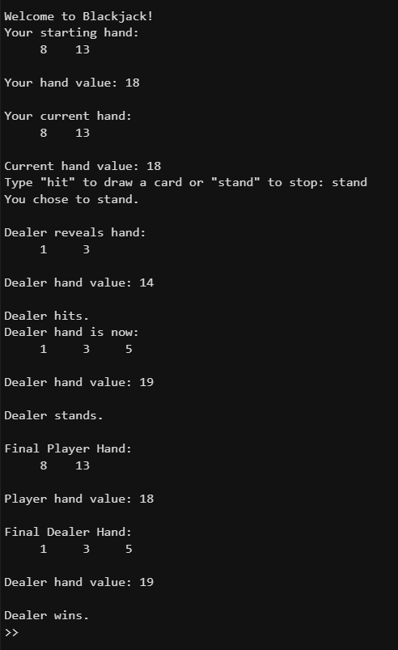
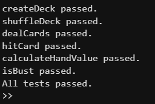

# Black-Jack-Game-Project

## Project description
For our team project, we created a playable Blackjack game with MATLAB.

The program creates a deck of cards, shuffles it, deals cards to the player and dealer, lets the player choose to hit or stand, applies the dealer rules, calculates hand values, and determines the final result.

We displayed the game directly in the MATLAB Command Window so the player can follow each step of the round.

## Getting Started
  
First, clone the project into MATLAB using:
```
git clone https://github.com/gracexu-crypto/Black-Jack-Game-Project
```

To play the game, run:
```
main
```

To run the tests, use:
```
test
```

## Program Output

**Game Example**


**Test Results**


## Challenges and Solutions

### Grace:

Implementing `playerTurn` was the biggest challenge for me in this project. At the beginning, it seemed like I only needed to ask the player to type `hit` or `stand`, but once I started writing the loop, I realized there were several cases to handle at the same time. The program needed to keep asking for input, update the hand after each hit, stop immediately if the player busted, and also reject invalid input without breaking the game flow.  
  
I solved this by using two boolean variables, `playerBust` and `playerStand`, to control the loop clearly. That made it easier for me to separate the different stopping conditions and keep the logic readable. 

Another challenge appeared near the end of the project. We found that keeping both the real Blackjack game and all the test cases in `blackjack.m` made the workflow feel a little weird, since the game would run first and only then the tests would start.

At first, I thought reorganizing the file structure would be simple and that I only needed to split the helper functions into separate files. But once I did that, the project suddenly started breaking in different places and would not run correctly. 

The issue was that once the helper functions were separated, I had to be much more careful about how they called each other. For example, `playerTurn` depends on `hitCard`, `displayHand`, `calculateHandValue`, and `isBust`, so even a small mismatch in function behavior could cause the whole turn logic to fail.

I fixed this by going back through the functions one by one and checking their inputs, outputs, and roles in the overall game flow. I made sure each helper function had a clear purpose, returned exactly the values the next function needed, and interacted cleanly with the rest of the program. 

In general, my biggest takeaway from this project was that I found implementing the functionality of a single function is usually not the hardest part. The real challenge is making multiple functions interact correctly and fit together into one complete program.This is a point that requires even more attention.

### Danielle:
Creating the functions to calculate the hand value and determine when a player busts was one of the most challenging parts of this project for me. Initially, it appeared to be easy to just add the values of the cards, but it became complicated when I needed to manage face cards and aces.

Face cards are easy to implement since they are all valued the same, but aces are more challenging since they can be valued as 1 or 11. I had to implement a way for the player to not bust, but also have the program choose the best value.

My original plan was inadequate because it didn't account for all the aces, and I noticed some hands were being counted wrong. I knew this because a hand with two aces and a non-face card would be counted over 21 when it shouldn't have. I knew I had to find a better way to manage the value of aces.

I accomplished this for each of the programmable hands by first treating every ace as an 11, and within the code for the hand evaluation, I looped through the hand and if any of the hand values exceeded 21, I dynamically adjusted the hand value and set that ace to be worth 1 instead of 11. With this, the program was able to dynamically set the value of an ace and always yield the correct result. After applying this logic, I was able to achieve a hand value that was much more exact.

Another challenge was integrating the correct functionality and logic for bust detection into the rest of the program, as there are many areas that game logic relies on whether a player/dealer has busted or not. For this, I crafted an isBust function that checks if the hand value is exceeding 21 and returns true. This modularized the code and made it easier to implement for the player turn/dealer turn.

Overall, the major learning outcome from this part of the project is that multiple game rules complicate simple logic quite significantly. It is important to consider edge cases like multiple aces and design functions that are modular and easy to implement to reduce duplicate code while increasing functionality.
